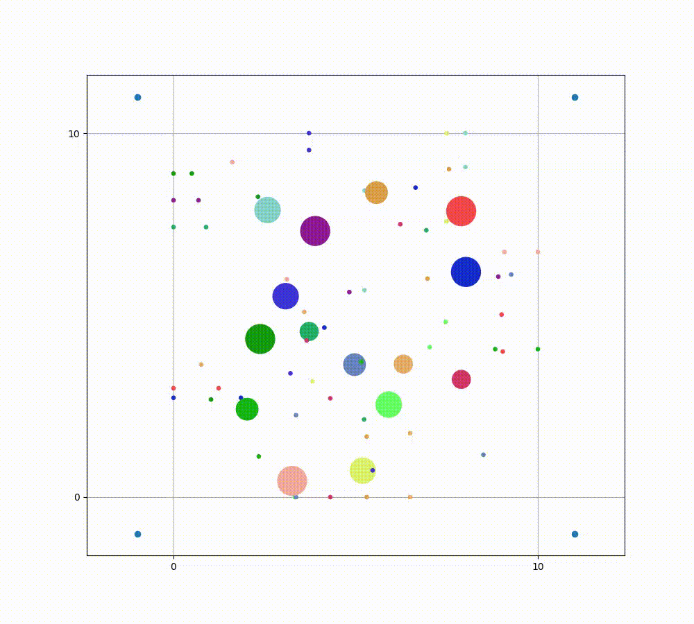
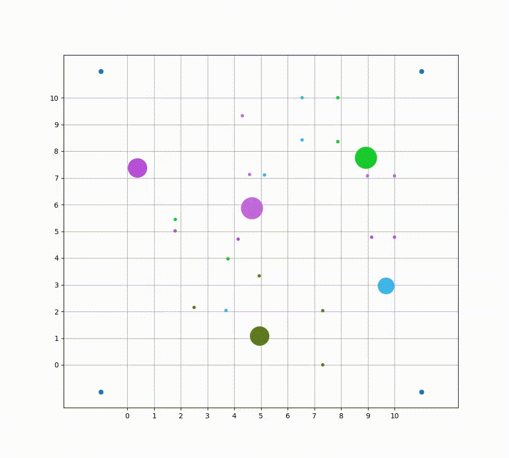
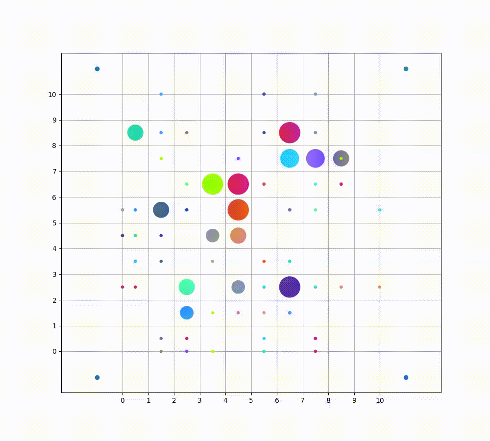

# Deadlock-handling-in-multi-mobile-robot-systems

The main goal of the thesis is a comparison of deadlock handling methods for multi mobile robot systems. The thesis of this work can be formulated as: ''Are simple methods of deadlock handling able to significantly increase success rate, without greatly increasing time required to finish the task in multi mobile robot system?'' Simple method is defined as method in which the positions of other robots in working area is not taken into consideration during pathfinding, action is executed when deadlock appear, or resources are allocated in the simplest way, that is, the first one that try will obtain a given resource.

### Retreat Method: Euclidean, Step Aside Method

### Retreat Method: Manhattan

### Grid Motion Space Case
